<div align="center">

# Huzaifah Multi-Rice v6.0.0 — Sumi

<!-- SUMI_BADGES_START -->
[](https://github.com/huzaifahshahid71-ops/dotfiles/stargazers)
[](https://github.com/huzaifahshahid71-ops/dotfiles/forks)
[](https://github.com/huzaifahshahid71-ops/dotfiles/releases/latest)
[](https://github.com/huzaifahshahid71-ops/dotfiles/commits/main)
[](LICENSE)
<!-- SUMI_BADGES_END -->

**12 desktops. One Sumi Deck. One install command.**

**8 Hyprland · 4 Niri · 74 login themes · 8 GRUB themes · 631 wallpapers**

[Download v6](https://github.com/huzaifahshahid71-ops/dotfiles/releases/tag/v6.0.0) · [Installation guide](https://github.com/huzaifahshahid71-ops/dotfiles/releases/download/v6.0.0/CachyOS-Sumi-v6-FHDplus.mp4) · [Wallpaper collection](https://github.com/huzaifahshahid71-ops/multi-rice-wallpapers)

</div>

Sumi brings twelve separate desktop profiles together with a shared desktop switcher, searchable shortcuts, music controls, login-theme previews and GRUB-theme selection. Install it on an existing **x86_64 CachyOS or compatible Arch Linux desktop**. Setup checks system and package compatibility before installation.

<p align="center">
<a href="screenshots/v6/006-Screenshot_2026-10-07_18-09-53.png">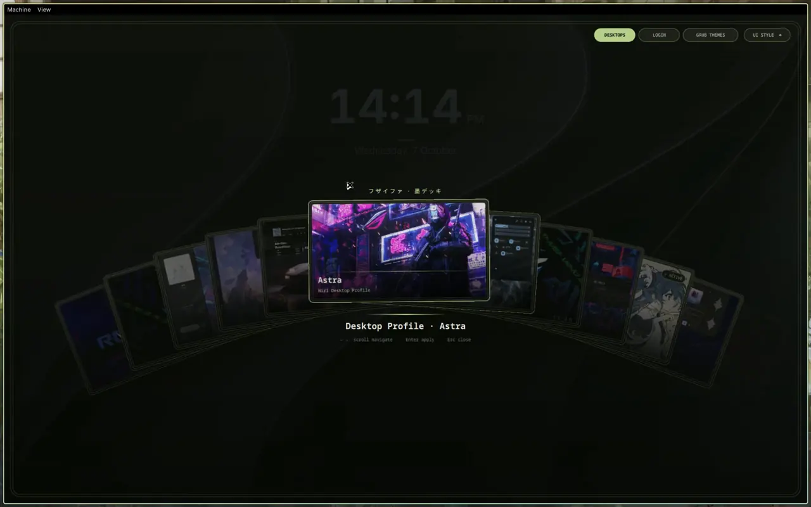</a><br>
<sub>Sumi Deck — switch desktops, preview login themes and choose GRUB themes.</sub>
</p>

[Install](#install-with-one-command) · [Desktop gallery](#v6-desktop-gallery) · [Login and boot](#login-and-boot-themes) · [Video](#installation-video) · [All 120 screenshots](screenshots/v6)

## Install with one command

Run in your graphical desktop terminal, as your normal user:

```bash
curl -fsSL https://github.com/huzaifahshahid71-ops/dotfiles/releases/download/v6.0.0/ONLINE-INSTALL-v6.sh | bash
```

This opens **Sumi Setup**. Run preflight, choose your options, and start the backup and installation in the window. Authenticate when setup requests system changes. The command installs desktop customization on your existing Linux installation; install CachyOS itself first if you are starting from an empty machine.

<details>
<summary><strong>Setup screens: welcome and optional wallpapers</strong></summary>

<table>
<tr>
<td width="50%"><a href="screenshots/v6/001-Screenshot_2026-10-07_18-08-29.png">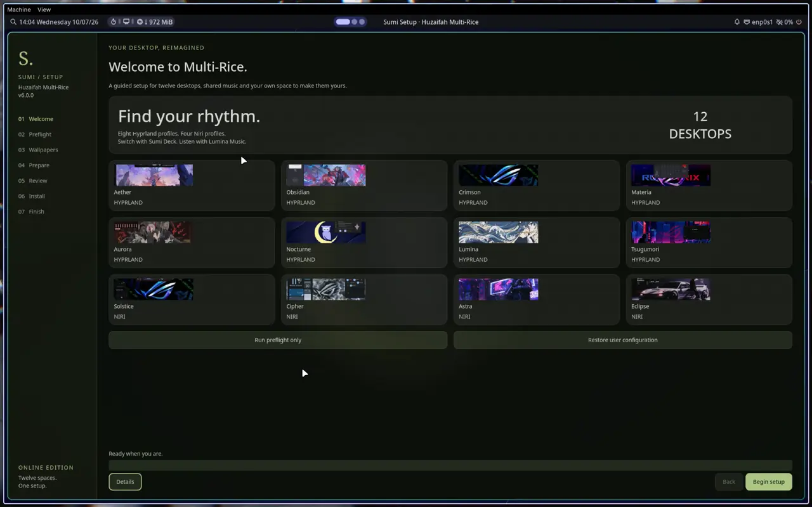</a><br><strong>Sumi Setup</strong><br><sub>Twelve desktops in one guided installer</sub></td>
<td width="50%"><a href="screenshots/v6/002-Screenshot_2026-10-07_18-08-47.png">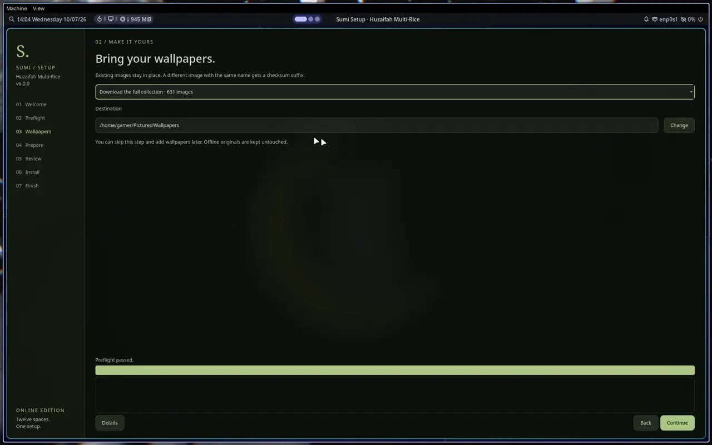</a><br><strong>Bring your wallpapers</strong><br><sub>Choose the optional collection and destination folder</sub></td>
</tr>
</table>

</details>

The public launcher currently selects **desktop-r3**, which includes the verified Crimson wallpaper-picker sources, Cipher search routing and Aether icon lookup fixes, alongside the earlier SDDM, quiet GRUB, MacTahoe icon and Lumina launcher/palette repairs. The initial launch may take several minutes while the payload is downloaded or extracted.

## All twelve rices

| Desktop in Sumi Deck | Profile | Compositor |
| --- | --- | --- |
| **Aether** | Caelestia (`caelestia`) | Hyprland |
| **Obsidian** | end4 (`end4`) | Hyprland |
| **Crimson** | Ambxst (`ambxst`) | Hyprland |
| **Materia** | DankMaterialShell (`dms`) | Hyprland |
| **Aurora** | Serpantinum (`serpantinum`) | Hyprland |
| **Nocturne** | Noctalia (`noctalia`) | Hyprland |
| **Lumina** | Sayconlun (`sayconlun`) | Hyprland |
| **Tsugumori** | Tsugumori (`tsugumori`) | Hyprland |
| **Solstice** | JAQC (`jaqc`) | Niri |
| **Cipher** | Clavis (`clavis`) | Niri |
| **Astra** | Nixri (`nixri`) | Niri |
| **Eclipse** | iNiR (`inir`) | Niri |

Each rice retains its own configuration and supporting files under `~/.local/share/desktop-profiles`. Use Sumi Deck to select and switch desktops.

## V6 desktop gallery

Captured from the new v6 installation. Click any preview for the original screenshot. Wallpaper, panel layout and colors vary with your choices.

<table>
<tr>
<td width="50%"><a href="screenshots/v6/029-Screenshot_2026-10-07_18-15-55.png">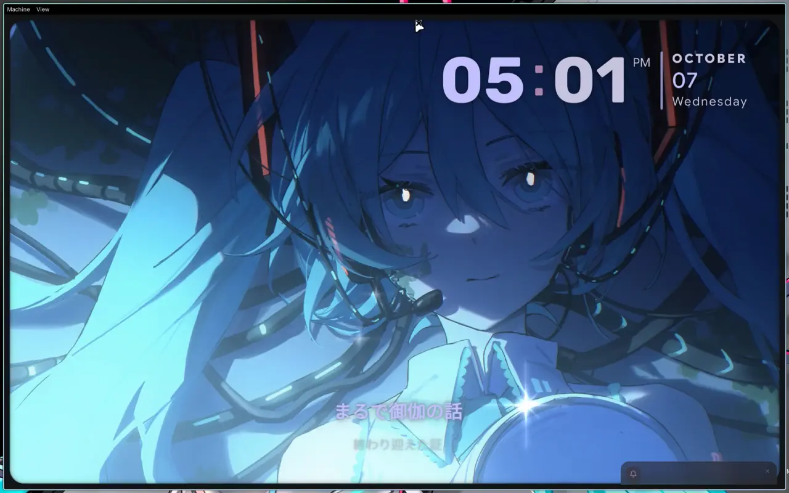</a><br><strong>Aether</strong><br><sub>Caelestia · Hyprland</sub></td>
<td width="50%"><a href="screenshots/v6/033-Screenshot_2026-10-07_18-16-32.png">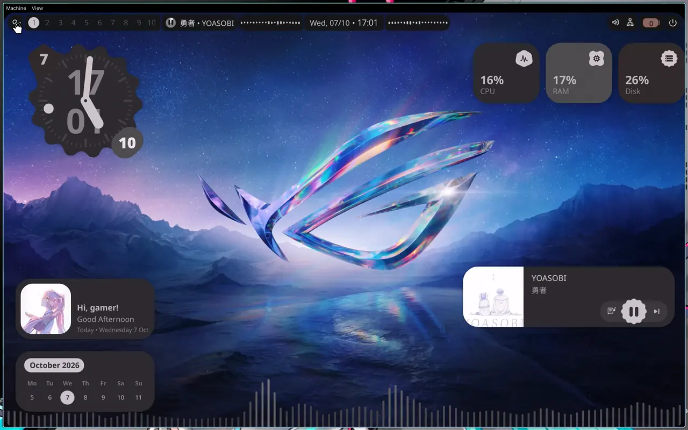</a><br><strong>Obsidian</strong><br><sub>end4 · Hyprland</sub></td>
</tr>
<tr>
<td width="50%"><a href="screenshots/v6/040-Screenshot_2026-10-07_18-17-43.png">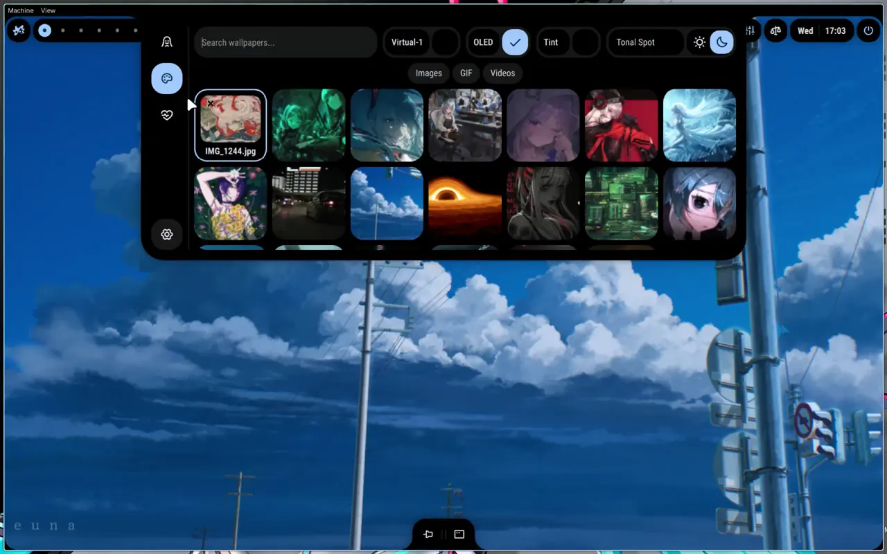</a><br><strong>Crimson</strong><br><sub>Ambxst · Hyprland</sub></td>
<td width="50%"><a href="screenshots/v6/051-Screenshot_2026-10-07_18-18-53.png"></a><br><strong>Materia</strong><br><sub>DankMaterialShell · Hyprland</sub></td>
</tr>
<tr>
<td width="50%"><a href="screenshots/v6/063-Screenshot_2026-10-07_18-21-09.png"></a><br><strong>Aurora</strong><br><sub>Serpantinum · Hyprland</sub></td>
<td width="50%"><a href="screenshots/v6/073-Screenshot_2026-10-07_18-22-51.png">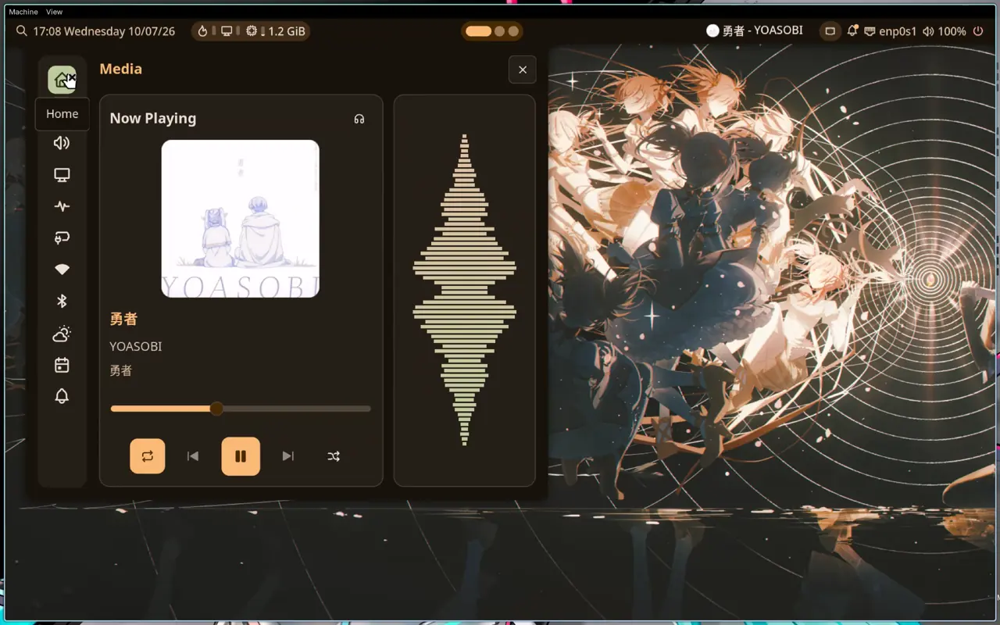</a><br><strong>Nocturne</strong><br><sub>Noctalia · Hyprland</sub></td>
</tr>
<tr>
<td width="50%"><a href="screenshots/v6/078-Screenshot_2026-10-07_18-23-44.png">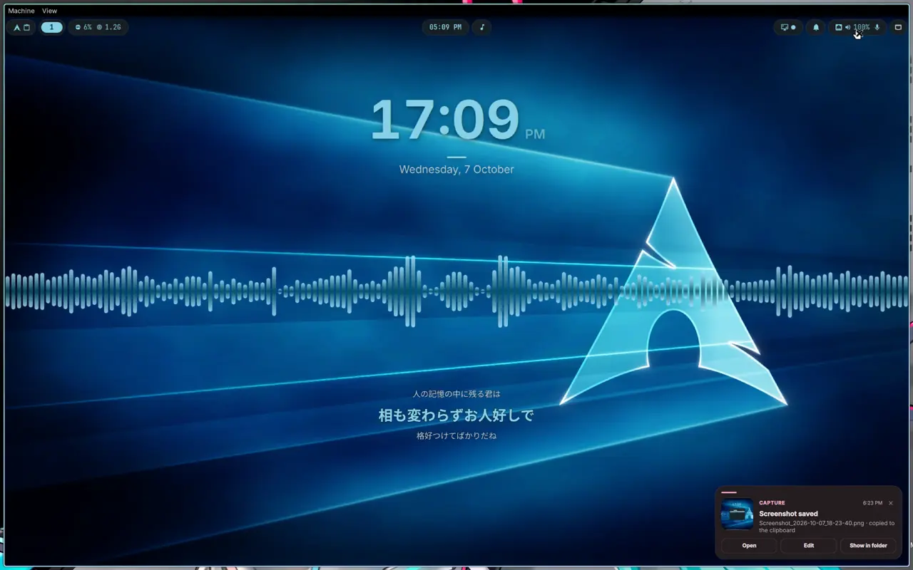</a><br><strong>Lumina</strong><br><sub>Sayconlun · Hyprland</sub></td>
<td width="50%"><a href="screenshots/v6/084-Screenshot_2026-10-07_18-25-19.png">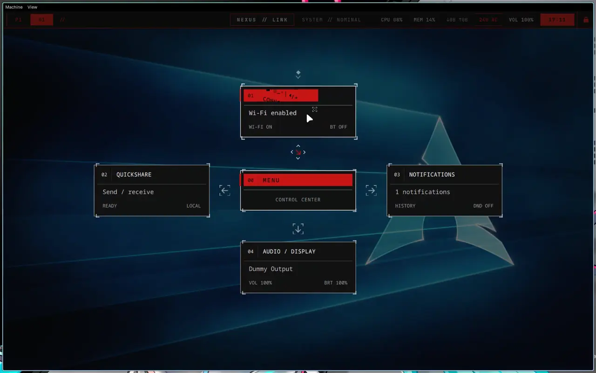</a><br><strong>Tsugumori</strong><br><sub>Tsugumori · Hyprland</sub></td>
</tr>
<tr>
<td width="50%"><a href="screenshots/v6/092-Screenshot_2026-10-07_18-26-13.png">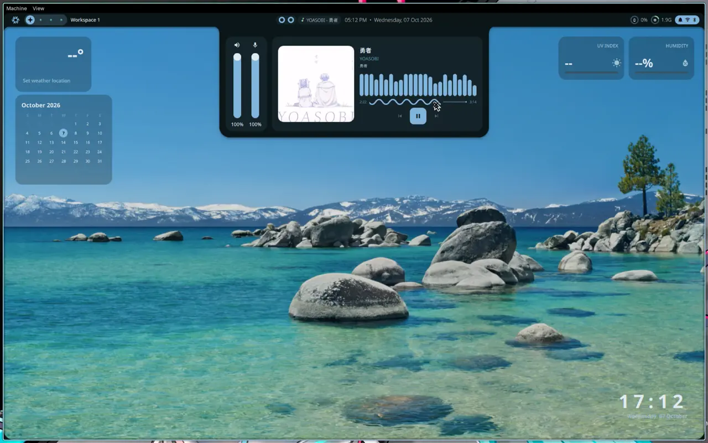</a><br><strong>Solstice</strong><br><sub>JAQC · Niri</sub></td>
<td width="50%"><a href="screenshots/v6/104-Screenshot_2026-10-07_18-28-16.png">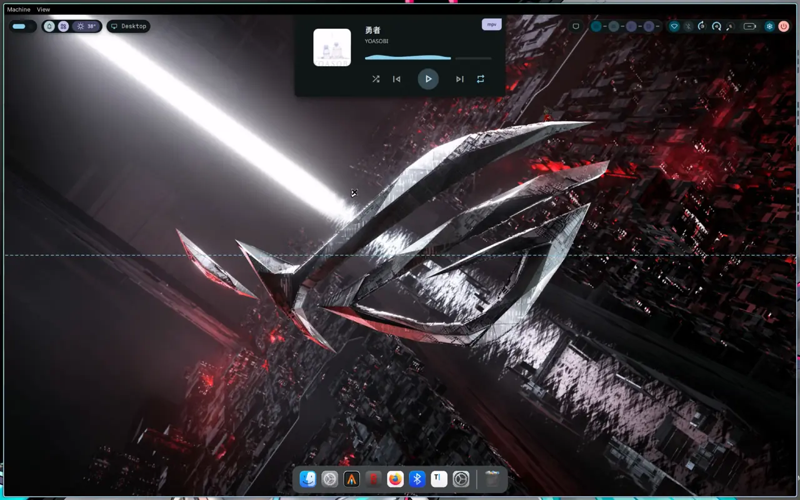</a><br><strong>Cipher</strong><br><sub>Clavis · Niri</sub></td>
</tr>
<tr>
<td width="50%"><a href="screenshots/v6/108-Screenshot_2026-10-07_18-28-58.png">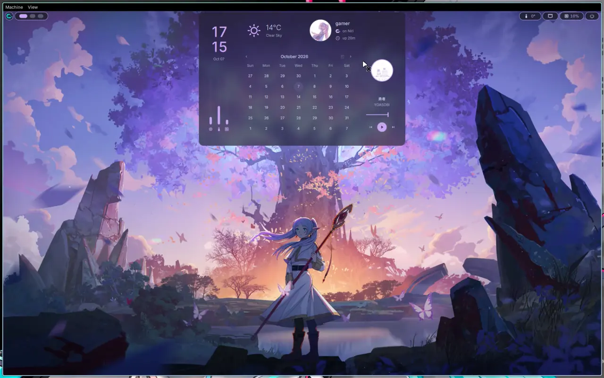</a><br><strong>Astra</strong><br><sub>Nixri · Niri</sub></td>
<td width="50%"><a href="screenshots/v6/117-Screenshot_2026-10-07_18-29-51.png">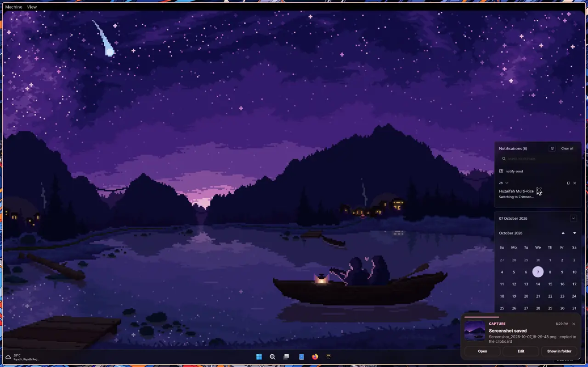</a><br><strong>Eclipse</strong><br><sub>iNiR · Niri</sub></td>
</tr>
</table>

[Browse all 120 screenshots](screenshots/v6) for more launchers, panels, wallpaper pickers and desktop views.


## Shared controls

| Shortcut | Opens |
| --- | --- |
| **Super + Shift + D** | Sumi Deck: desktop, LOGIN and GRUB cards |
| **Super + /** | Searchable keyboard-shortcut menu, with readable action names |
| **Super + Shift + M** | Shared music controls |
| **Super + Shift + R** | Refresh-rate controls |

Native launchers, settings and other bindings vary by rice. Open **Super + /** to see the active profile's shortcuts.

<details>
<summary><strong>Shared shortcuts and music controls</strong></summary>

<table>
<tr>
<td width="50%"><a href="screenshots/v6/016-Screenshot_2026-10-07_18-13-44.png">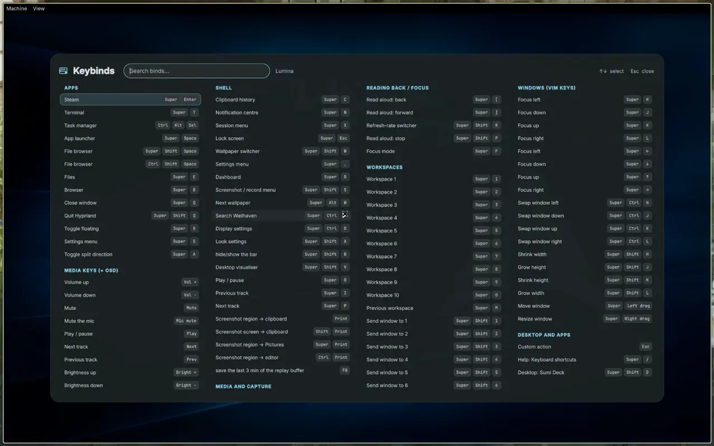</a><br><strong>Searchable shortcuts</strong><br><sub>Readable action names and key combinations</sub></td>
<td width="50%"><a href="screenshots/v6/018-Screenshot_2026-10-07_18-14-14.png">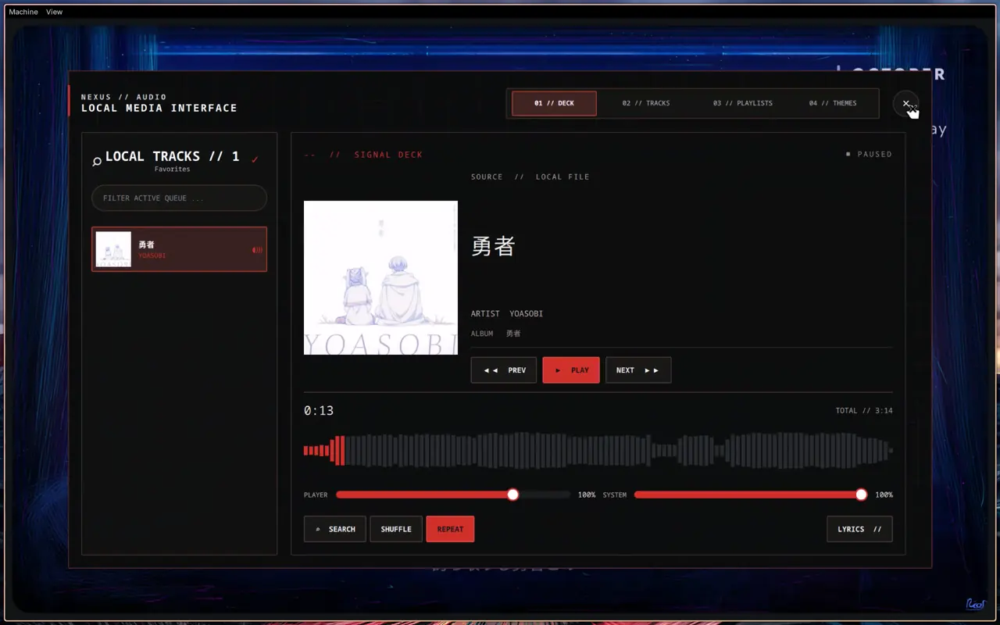</a><br><strong>Shared music controls</strong><br><sub>Local media playback and seeking</sub></td>
</tr>
</table>

</details>


## Login and boot themes

- **74 SDDM login cards**, including Frieren and four additional custom cards, with previews and authenticated selection in Sumi Deck → **LOGIN**.
- **Eight Evangelion GRUB cards** with previews and authenticated selection in Sumi Deck → **GRUB**. These require an existing GRUB installation.
- The fresh-machine fixes retain SDDM selection for the next boot and quiet GRUB configuration across theme changes.

SDDM cards customize the login screen. Desktop lock screens are provided by the active rice and its lock-screen tools.

<table>
<tr>
<td width="50%"><a href="screenshots/v6/007-Screenshot_2026-10-07_18-10-34.png">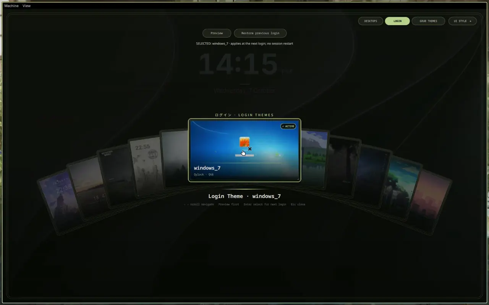</a><br><strong>LOGIN in Sumi Deck</strong><br><sub>Browse and preview login themes</sub></td>
<td width="50%"><a href="screenshots/v6/058-Screenshot_2026-10-07_18-20-11.png"></a><br><strong>Pixel Sakura</strong><br><sub>A login-theme preview</sub></td>
</tr>
<tr>
<td width="50%"><a href="screenshots/v6/052-Screenshot_2026-10-07_18-19-02.png">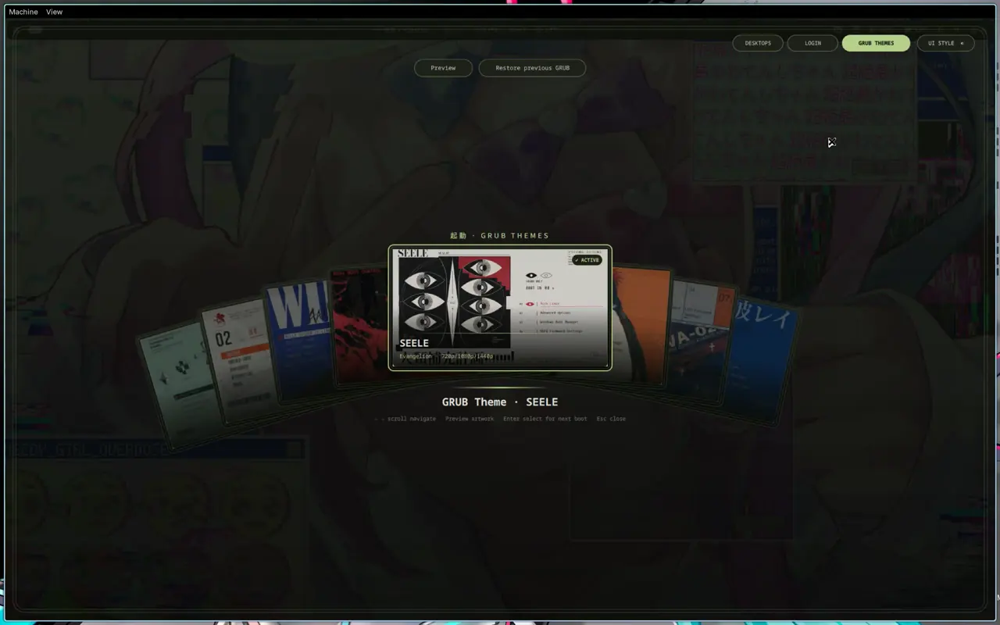</a><br><strong>GRUB in Sumi Deck</strong><br><sub>Browse the eight Evangelion themes</sub></td>
<td width="50%"><a href="screenshots/v6/120-Screenshot_2026-10-07_18-30-37.png">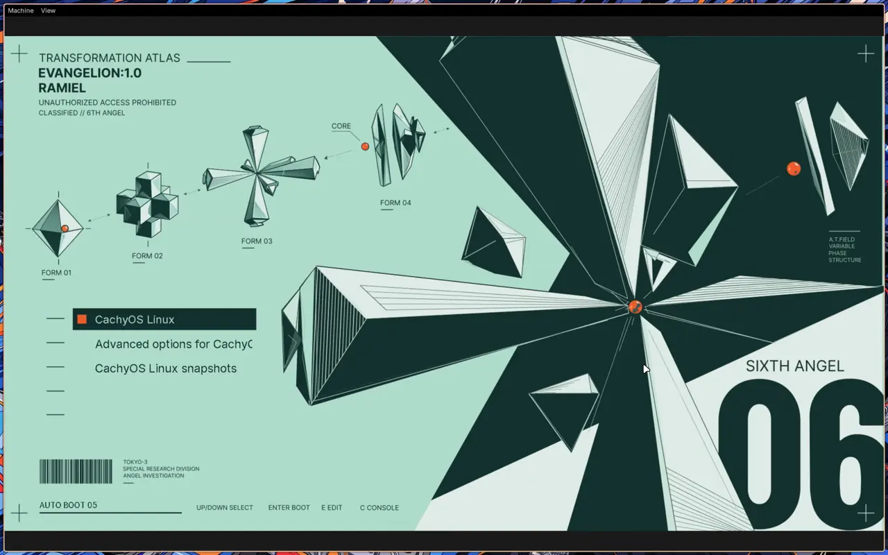</a><br><strong>Ramiel at boot</strong><br><sub>The selected GRUB theme</sub></td>
</tr>
</table>

<details>
<summary><strong>Authentication inside Sumi Deck</strong></summary>

[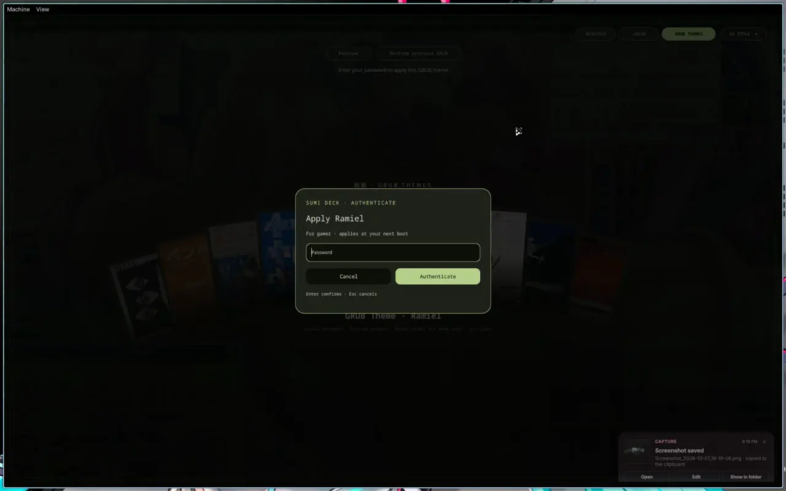](screenshots/v6/054-Screenshot_2026-10-07_18-19-12.png)

</details>


## Wallpapers

Choose the optional full collection in setup to download **631 wallpapers**. The downloader fetches **three ZIP packs in parallel**, then verifies and extracts the images locally. Choose the destination folder in setup and select wallpapers through your rice's wallpaper picker.

[Browse the wallpaper repository](https://github.com/huzaifahshahid71-ops/multi-rice-wallpapers) · [Pinned 631-image collection](https://github.com/huzaifahshahid71-ops/multi-rice-wallpapers/releases/tag/wallpapers-0aa529a78a8430dc)

## Installation video

<!-- SUMI_V6_SHOWCASE_START -->
[Watch/download the FHD+ CachyOS + Sumi v6 installation and showcase](https://github.com/huzaifahshahid71-ops/dotfiles/releases/download/v6.0.0/CachyOS-Sumi-v6-FHDplus.mp4).

[Watch/download the original CachyOS + v6 installation guide](https://github.com/huzaifahshahid71-ops/dotfiles/releases/download/v6.0.0/CACHY.OS.%2B.V6.INSTALL.GUIDE.mp4).
<!-- SUMI_V6_SHOWCASE_END -->

## Offline installation

From the [v6.0.0 release](https://github.com/huzaifahshahid71-ops/dotfiles/releases/tag/v6.0.0), download **`assemble-v6-r3.py`** into an empty directory and run:

```bash
python3 assemble-v6-r3.py
APPIMAGE_EXTRACT_AND_RUN=1 ./multi-rice-v6.0.0-r3-x86_64.AppImage
```

The assembler downloads `release-r3.json` and missing `.partNNN` files, verifies their SHA-256 hashes, and assembles the AppImage. For an offline machine, download all five r3 parts, `release-r3.json` and the assembler beforehand, then run them from the same directory. Keep `release-r3.json` beside the AppImage. The wallpaper collection is a separate optional download.

Use **setup's preflight** to check free space, graphical authentication and package compatibility. The payload includes CachyOS-optimized packages; installation depends on the preflight and dependency checks passing on your system.

## Backups and restore

Setup verifies a configuration backup before installation and records its installation receipt under:

```text
~/.local/share/huzaifah-multi-rice/v6-installations/
```

Use the receipt with the installer's restore function to restore backed-up user configuration and managed system desktop routes. Restore retains installed packages. Guards preserve files edited after installation rather than silently replacing them.

## Validation

The original v6 payload's twelve desktops, shortcuts, login themes, GRUB themes, installation and configuration restore were tested in CachyOS VMs. Fresh-machine appearance repairs and the three desktop-r3 fixes were also accepted in a fresh VM. The combined r3 build passed payload hash checks, GUI rendering and packaged backend checks; a complete new installation of that combined r3 image has not yet been accepted.

## Sources and credits

Release sources are maintained on [`v6.0-tahoe-dev`](https://github.com/huzaifahshahid71-ops/dotfiles/tree/v6.0-tahoe-dev). The [v6 release](https://github.com/huzaifahshahid71-ops/dotfiles/releases/tag/v6.0.0) includes the matching **`sumi-installer-source-v6.0.0-r3.zip`**, split payload, setup runtime and checksums. Older release assets remain available for their corresponding revisions; use matching revision files together.

This setup builds on Caelestia, end4, Ambxst/axctl, DankMaterialShell, Serpantinum, Noctalia, Sayconlun, Tsugumori, JAQC, Clavis, Nixri, iNiR, Hyprland, Niri, Quickshell and the included SDDM/GRUB and icon themes. Third-party projects retain their respective licenses and credits.

Original Sumi installer code, tools and documentation are licensed under [MIT](LICENSE). Bundled and adapted third-party components retain their respective licenses; see [licensing scope](LICENSING.md).

**App developer: Huzaifah.**
